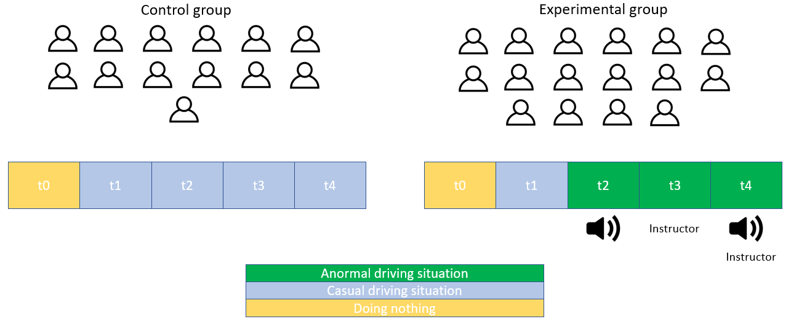
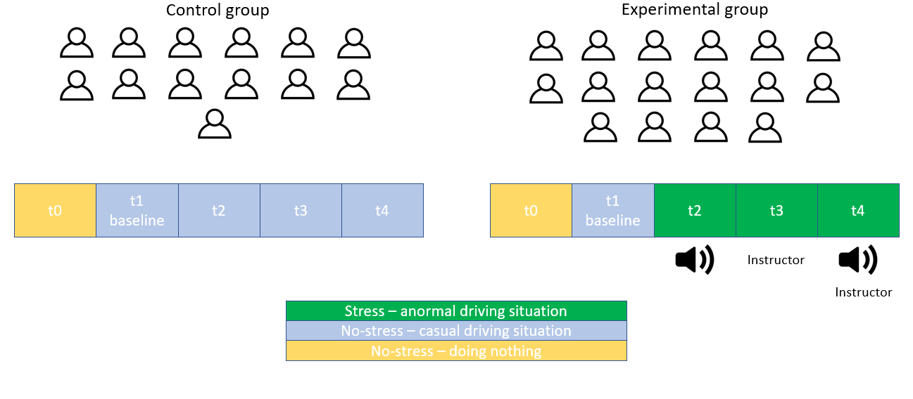
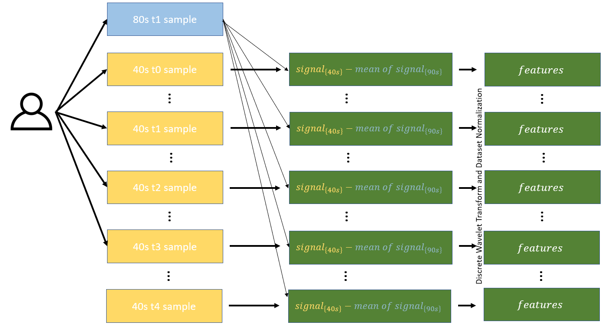
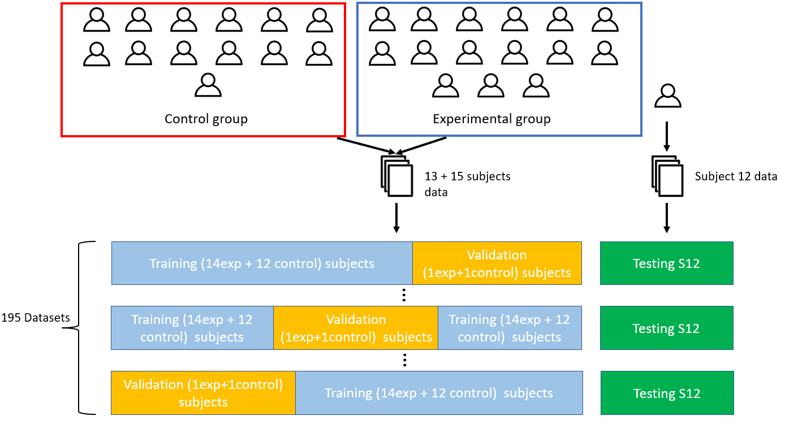
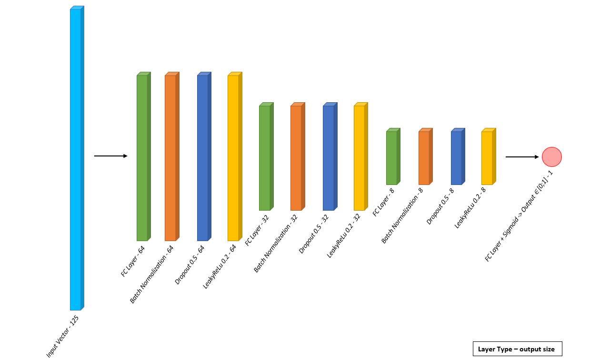
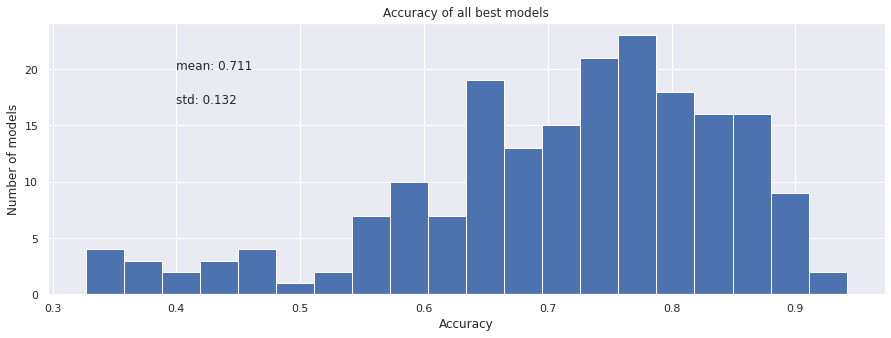
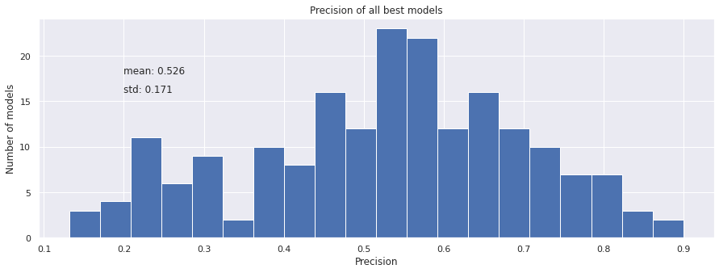
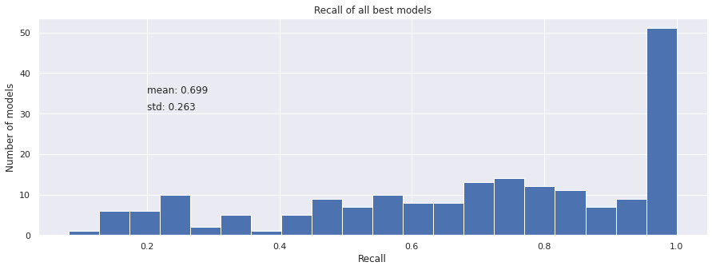
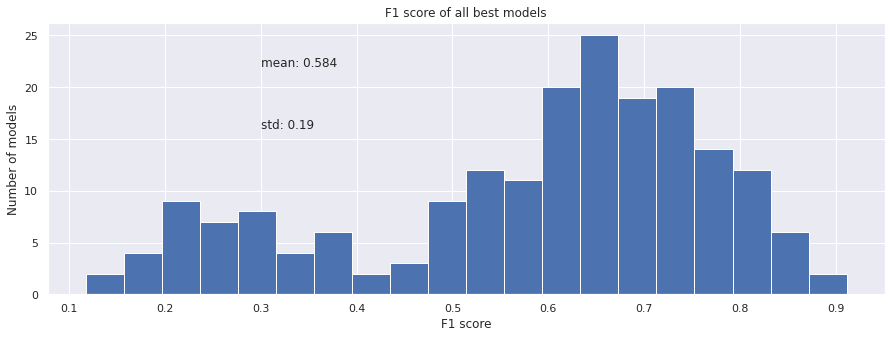

## Table Of Contents
* [Introduction](#introduction)
* [Dataset](#dataset)
* [Data Pre-Processing](#data-pre-processing)
* [Model and Training](#model-and-training)
* [Cross Validation Results](#cross-validation-results)
* [Results on testing set](#results-on-testing-set)
* [What's next ?](#whats-next)
* [References](#references)

## Introduction

This project aims to develop a deep learning model able to predict the emotional state (stress/no stress) of an individual based on its Pupil diameter evolution. The model has been trained on a dataset built by Pedrotti et al [[1]](#1) that can be found <a href="https://www.researchgate.net/profile/Marco-Pedrotti-2/publication/266613485_PUPILLARY_DATA_-_Automatic_stress_classification_with_pupil_diameter_analysis/data/543532a70cf2bf1f1f282679/data.zip?origin=publication_list">here</a>.

## Dataset

The dataset was built by Pedrotti et al [[1]](#1) for their study. The study aimed to detect stress using wavelet transform and deep learning with pupil and electrodermal activity during driving sessions.

Among the measures, the dataset contains pupil size measures of 17 subjects from the experimental group and 14 subjects from the control group. The subjects were supposed to drive on a simulator in stressing or normal situations (control group drove in normal conditions in all sessions, experimental group drove in normal conditions during the first session and then was disturbed by sounds or the presence of instructors during driving tasks). The pupil size was measured with a frequency of 50Hz during 80s for each subject and each task. There was also a baseline task that was doing nothing. This conducts to 5 sessions of 80s for each subject. 

| Session Number    | Conditions for experimental group           |
|:-------------:|:-------------:|
|t0 | Doing Nothing|
|t1 | Normal Driving|
|t2 | Drive With Random Sound Alarms|
|t3 | Drive With Instructors|
|t4 |Drive With Random Sound Alarms & Instructors|

  

## Data Pre-Processing

The Preprocessing of the data is done from the <a href="https://www.researchgate.net/profile/Marco-Pedrotti-2/publication/266613485_PUPILLARY_DATA_-_Automatic_stress_classification_with_pupil_diameter_analysis/data/543532a70cf2bf1f1f282679/data.zip?origin=publication_list">raw data</a> using the notebooks <a href="./PD ds creator.ipynb">PD ds creator.ipynb</a>.

The training has been done with a cross-validation process. I extracted features from samples of 40s with a 1s step from every recording, these samples were coupled with a label : 
  * for t0 and t1 label=0 as non-stressed
  * for t2, t3 and t4 label=1 as stressed

  

The pupil diameter (Pd) can be very different from person to person, to normalize my data I chose a baseline moment. I chose the first session of driving as the baseline because it induces a "normal situation", not especially stressing but more than a "doing nothing situation". I computed the mean pupil diameter on the complete baseline signal. Then I computed :

$$ Pd_{normalized}(t)= Pd(t)-\overline{Pd_{Baseline}}$$

Then from each 40s (2000 points) signal, I extracted a 125 points feature vector by applying a discrete wavelet transform with 4 levels and with Haar's window. Finally, each 125 points feature vector was normalized by the average mean and the average standard deviation of all the 125 vectors in the dataset. By doing this we ensure that our dataset is normalized.

  

I split the data of 29 subjects (13 from the control group and 16 from the experimental group) into training, validation, and testing to avoid overfitting (as my features are extracted from 40s samples with a sliding window picking training and validation/testing data on the same subject would cause overfitting).

Subjects for training and validation have been permuted as I planned to use K-fold cross-validation (2 subjects (1 control and 1 experimental) in validation, 27 in training (12 control and 15 experimental)), and I created 195 datasets. I selected subject 12 to be my testing subject and I never included this subject in the creation of a fold dataset.

  

## Model and Training

The training and results analysis of the model can be done using the notebooks <a href="./Pd_calissifer.ipynb">Pd_calissifer.ipynb</a>.

My model is a Full Connected Neural Network. Each Full Connected (FC) layer is followed by a Batch Normalization layer, a Dropout(p= 0.4) layer, and a LeakyRelu (a=0.2) layer.   The size of these layers decreases from 64 &#8594; 32 &#8594; 8 &#8594; 1. The final FC layer is followed by a Sigmoid function to obtain an output &#8712; [0;1]. 

The input size is 125 and the output size is 1. An output > *a-given-threshold* is considered as a stress state.

  

For each fold (of the 195-fold), the model has been trained with :

&#8594; **Loss Function** = Binary Cross Entropy  
&#8594; **Epochs** = 250  
&#8594; **Batchsize** = 256  
&#8594; **Learning rate** = 0.0001  
&#8594; **Optimizer** = Adam(learning rate,beta1=0.9,beta2=0.999)  

For each fold training, the best model has been saved (based on the validation set loss value) to compute the results of the cross-validation.

## Cross Validation Results

The **threshold** to predict stress or not is set to 0.35 after cross-validation results analysis.

The confusion Matrix used is a 2x2 confusion matrix with Stress/No stress as ground truth and Stress/No stress as the prediction. This confusion matrix is computed from the validation set and the values in the confusion matrix represent a percentage of the data of the validation set.

For the best model of each fold, the confusion matrix is computed on the validation set and the average model confusion matrix is computed.

  

From the best model of each fold these metrics have been computed on the validation set :

  

  

  

  

The average metrics of my model are :

| Metrics      | Mean &#177; Std|
|:-------------:|:-------------:|
|Accuracy | 0.711 &#177; 0.132|
|Precision| 0.526 &#177; 0.171|
|Recall| 0.699 &#177; 0.263|
|F1 score| 0.584 &#177; 0.19|

Firstly it is interesting to analyze the accuracy distribution, it appears that for some subjects the model is not working properly with low accuracy, for others the model works quite well, one explanation would be that some subjects' pupil diameters may be not responsive to a stressful situation. One other explanation could be that the t1 task (driving normally) already induced stress for the subject and then for t2, t3, and t4 the subject got used to the driving task and was on the same level of stress as in t1 because of the stressing factors. This shows why it is important to use cross-validation to validate the model.

Then we can see that the precision and f1 score have a low average, this can be explained because the datasets of validation are unbalanced (1 control subject = 5 non-stressed extracts, 1 experimental subject = 2 non-stressed extracts, and 3 stressed extracts). A validation set is made of 70% of non-stressed data and 30% of stressed data and this explains why the precision is low.
Supposing that the model will give the same results on a balanced dataset, we could predict a confusion matrix (real training and validation with balanced datasets will be done in the future):

  

Such confusion matrix would give :

| Metrics      | Mean Value|
|:-------------:|:-------------:|
|Accuracy | 0.7076|
|Precision | 0.7115|
|Recall | 0.6986|
|F1 score| 0.7050|

Pedrotti's paper [[1]](#1) did not use the same model and data treatment. However, it is interesting to compare our methods. In their paper, they use the Wavelet transform on 80s extract while we are only using 40s extract in our work. Moreover, there is no cross-validation process in their training, 6 subjects from the experiment set are selected to be the validation set. Finally, they use a different model and train with a low amount of data (such as not using t0). I computed accuracy for a stress classifier like we would like to obtain from their model results:

| Metrics      | Mean Value|
|:-------------:|:-------------:|
|Accuracy | 0.9166|
|Precision | 0.6666|
|Recall | 1.0000|
|F1 score| 0.7995|

My Deep Learning model has lower performances, yet I believe that the cross-validation that I have done gives safer results because I validated each subject.

## Testing Results

The model has been retrained with the same process on the complete cross-validation dataset (training + validation) to be tested on new data (subject 12 data).
The best model gives the following confusion matrixes for the testing set (Subject S12):

  

* **Accuracy** = 0.8829
* **Precision** = 0.8367
* **Recall** = 1.00
* **F1 score** = 0.9111

Here we can see that the model performed well on Subject 12 data.

## What's next ?

I would like to continue to work on that model to improve it. My next task will be to train it with a balanced data set and analyze the data of subjects on who the model performs badly.

## References
<a id="1">[1]</a> Marco Pedrotti et al. “Automatic Stress Classification With Pupil Diameter Analysis”. In:
International Journal of Human-Computer Interaction 30 (3 Mar. 2014), pp. 220–236. issn:
10447318. doi: <a href="https://doi.org/10.1080/10447318.2013.848320">10.1080/10447318.2013.848320</a> </a>.
